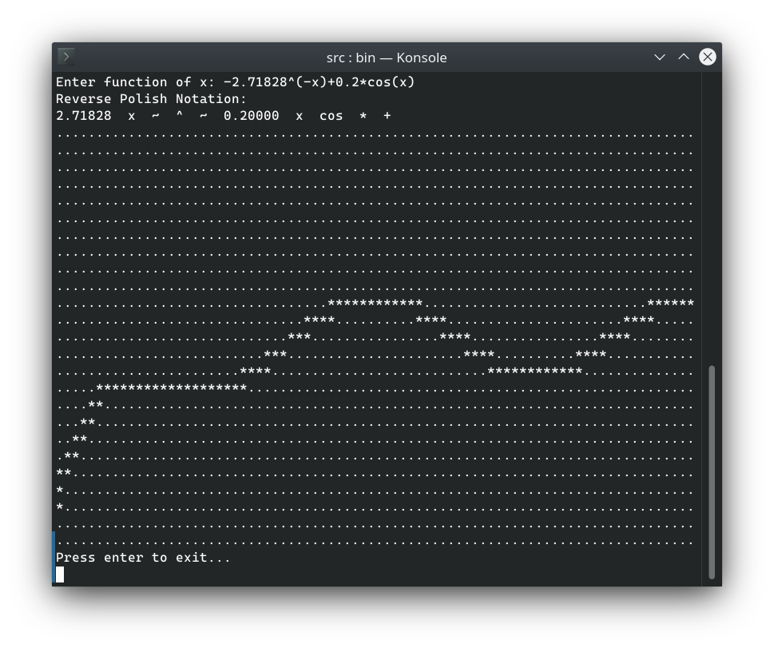

# Обратная польская запись и отрисовка графика функции в терминале

Программа для разбора математического выражения и преобразования его в обратную польскую нотацию. После преобразования выражения программа выводит в терминал график введенной функции.
Чтобы собрать проект, в каталоге ```src/``` введите стандартное правило ```make```. Исполняемый файл ```bin``` будет находиться в каталоге ```src/```. Чтобы изменить диапазон значений по осям x и y и количество символов, которое занимает график в терминале, измените соответствующие определения в файле ```src/config.h``` и пересоберите проект с помощью ```make```.


